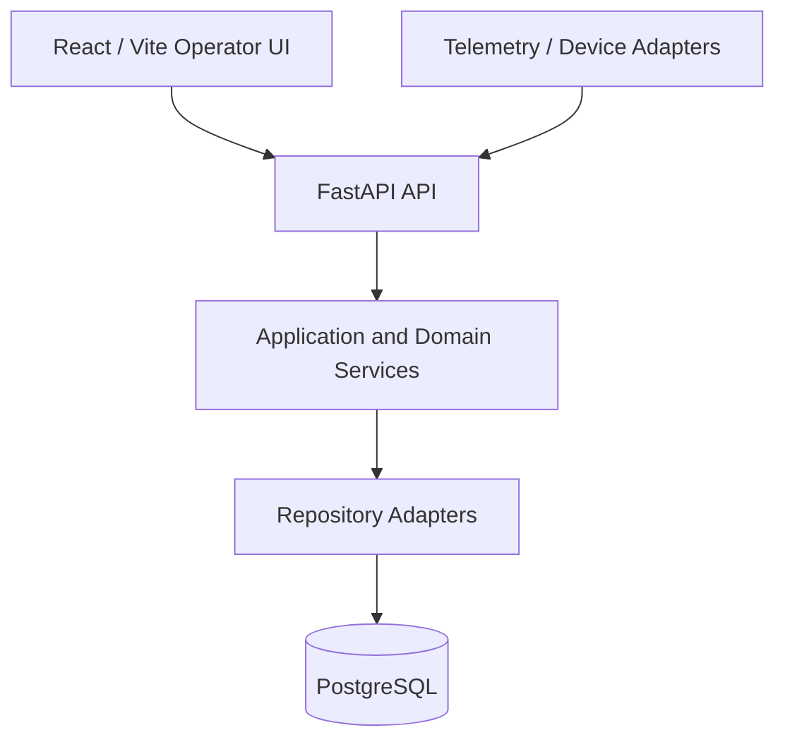

# DairyOS Technical Manual

**Audience:** Technical administrators, developers, deployment and support staff  
**Offline system location:** Settings → Help & Documentation

## 1. Architecture and authority

### Runtime model

DairyOS uses a Python/FastAPI backend with SQLAlchemy persistence and a React/Vite operator application. The backend is organised around models, repositories, application/domain services and API routers. The web shell consumes backend-authoritative read contracts.

### Authority principle

Authoritative domain data is persisted once. Higher layers consume lower-layer truth and must not redefine it. Current operational state, effective milking schedule, milk completeness, reconciliation, dispositions and analytics each have explicit backend authorities.

### Main runtime surfaces

- **FastAPI:** API/runtime boundary.
- **SQLAlchemy:** PostgreSQL persistence boundary.
- **Repository layer:** persistence adapters and domain access.
- **Service layer:** business rules and derived intelligence.
- **React/Vite:** operator presentation and navigation.
- **Settings documentation:** bundled static help with no API dependency.

## 2. API contract map

### Key operational routes

| Capability | Route |
| --- | --- |
| Main dashboard | GET /dashboard |
| Settings | GET/PUT /settings |
| Animals | GET/POST /farm/animals |
| Animal passport | GET /farm/animals/{animal_id}/passport |
| Effective milking schedule | GET /farm/animals/{animal_id}/milking-frequency/history |
| Milk entry | POST /farm/milk |
| Milk analytics | GET /farm/milk/analytics |
| Milk production summary | GET /farm/milk/production-summary |
| Milk reconciliation | GET /farm/milk/reconciliation?production_date=YYYY-MM-DD |
| Milk dispositions | GET /farm/milk/dispositions |
| Analytics catalog | GET /farm/analytics/catalog |
| Analytics implementation contract | GET /farm/analytics/implementation-contract |
| CMP scenarios | GET/POST /farm/cmp/scenarios |
| Heat-stress intelligence | GET /farm/heat-stress/intelligence |
| Findings | GET /farm/findings |
| Health observations | GET /farm/health-observations |
| Breeding | GET/POST /farm/breeding |
| Feed | GET/POST /farm/feed |
| Finance | GET/POST /farm/financial |

The generated **/openapi.json** is the application-level route contract. Date-scoped analytics should reject an omitted required date rather than silently guessing one.

## 3. PostgreSQL and persistence

### Connection configuration

The database session module resolves **DAIRYOS_DATABASE_URL** first, then DAIRYOS_DB_HOST/PORT/NAME/USER/PASSWORD. SQLAlchemy uses the **postgresql+psycopg** dialect.

Production startup refuses to fall back to the well-known development password when an explicit production password is absent.

### Schema and migrations

ORM models are registered at the database initialization boundary. Schema evolution belongs to the migration layer; runtime create_all is an initialization boundary, not a substitute for controlled production migrations.

### Backup

Use `scripts/database_backup.py` for PostgreSQL dumps and verification. The utility normalizes SQLAlchemy PostgreSQL URLs to a libpq-compatible target and does not place the database password in the command-line target. Prefer a disposable restore target for acceptance testing.

## 4. Deployment configuration

### Local development

Typical local configuration uses PostgreSQL on localhost:5432. The web application defaults to http://127.0.0.1:8000 unless an explicit frontend API URL is supplied.

### Docker Compose

Production compose supplies explicit PostgreSQL credentials and an authentication secret through environment variables. The API waits for a healthy database service before starting.

### Frontend build

Run `npm ci` followed by `npm run build` in `src/DairyOS.Web`. TypeScript checking must pass before Vite emits production assets.

### CORS

Browser origins are intentionally constrained to the reviewed local operator-development port range. Production deployments should set an explicit frontend origin policy.

## 5. Sensors and device integration

### Integration pattern

Device or telemetry adapters should submit observed facts with explicit observation date/time, source identifier and attributable payload. Validate the payload at the integration boundary before persistence.

### Environmental telemetry

Heat-stress intelligence consumes persisted environmental observations and governed milk production dates. Correlation should only be reported when both source populations have sufficient coverage.

### Recommended message envelope

Use fields equivalent to `source_id`, `observed_at`, `measurement_type`, `value`, `unit` and `quality/status`.

Do not embed dashboard-only calculations in devices. Store measurements; derive farm intelligence in the backend.

## 6. Diagnostics, errors and logs

### Runtime checks

- **GET /health:** service health.
- **GET /readiness:** readiness including database/runtime state.
- **GET /openapi.json:** mounted API contract.

### Diagnostic sequence

1. Capture the failing route and HTTP status.
2. Capture the server log entry and traceback.
3. Determine whether persistence succeeded before a derived observer failed.
4. Check PostgreSQL connectivity and migration/schema state.
5. Reproduce with the smallest valid request.

Never log passwords, authentication secrets, full connection strings or other credentials.

### Failure classes

- **Transport/API failure:** route cannot be reached or returns infrastructure error.
- **Validation failure:** request shape or required domain input is invalid.
- **Persistence failure:** authoritative fact could not be stored.
- **Derived-observer failure:** the persisted fact succeeded but downstream monitoring/intelligence failed; inspect logs and findings.
- **Completeness deficiency:** data is absent or incomplete; do not manufacture a zero or synthetic measurement.

## 7. Testing and release gates

### Required local gates

1. `pytest -q` for full Python regression.
2. `python -m compileall -q src` for Python compilation.
3. In `src/DairyOS.Web`, `npm ci` then `npm run build`.

### CI expectations

CI should use least-privilege workflow permissions, install all test dependencies used by lifecycle and compose gates, require the frontend build and fail on known production dependency vulnerabilities.

### Backup acceptance

A production-like backup should be generated, verified and restorable to a disposable PostgreSQL target before release. Restore testing must be isolated from the live operational datastore.

## 8. Security hardening

- Do not commit `.env` files, database dumps, SQLite files or backup artifacts.
- Do not use development default credentials in production.
- Treat frontend visibility as presentation only; enforce permissions in the API.
- Protect destructive reset operations before production deployment.
- Use explicit environment variables or secret management for credentials.
- Keep CI workflow permissions to the minimum required scope.
- Run dependency audits for Python and frontend production dependencies.

### Incident evidence

Preserve timestamps, route, status code, application error, affected subsystem and relevant commit SHA. Redact secrets before sharing logs.

## 9. Production deployment checklist

- [ ] Explicit production database credentials configured.
- [ ] Production authentication secret configured.
- [ ] Database migrations applied and schema checked.
- [ ] Backup and restore acceptance completed.
- [ ] Python regression and compile gates passed.
- [ ] Frontend production build passed.
- [ ] Dependency vulnerability audits passed.
- [ ] Destructive reset protection enabled.
- [ ] Reviewed CORS/origin policy configured.
- [ ] Health and readiness endpoints monitored.
- [ ] Log retention and credential-redaction policy verified.

## 10. Support runbook

When escalating a technical fault, provide the exact commit SHA, route, HTTP method/status, UTC/local timestamp, relevant operational date, affected subsystem, concise reproduction steps and sanitized log evidence. Do not attach credentials, raw connection strings or secrets.
